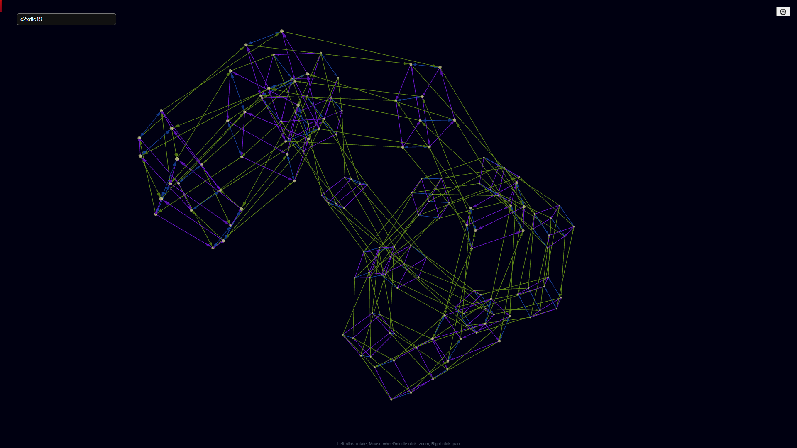

# Cayley Grapher

A browser-based Cayley graph visualizer that renders finite groups in 3D using a lightweight JavaScript implementation and [`3d-force-graph`](https://github.com/vasturiano/3d-force-graph).

## Features

- **Interactive 3D graph** rendering powered by `3d-force-graph`.
- **Group search** with fuzzy matching (Fuse.js) to quickly find groups by name.
- **Generator toggles** to show/hide edges associated with specific generators.
- **Client-side group construction** from the bundled dataset.

## Quick start
### Browser Use
You can access a live version of this project hosted [here](https://vjikholg.github.io/cayley-grapher/)

### Building/Developing
Because the app uses ES modules and fetches local JSON data, it must be served over HTTP. This can be done using Vite quickly and easily. 

```bash
# 0) Clone the repository
git clone https://github.com/vjikholg/cayley-grapher

# 1) Navigate to repository, and install dependencies (optional for current CDN usage, but kept for local tooling)
npm install

# 2) Build using Vite
npx vite

# 3) Open in your browser
localhost:DEFAULT_VITE_ADDR
```

## Usage

1. Open the app in a browser.
2. Use the **search box** to find a group by name.
3. Click a result to load its Cayley graph.
4. Open the **settings panel (⚙️)** to toggle generators on/off.

## Data

Group definitions are stored in `data/output_order500.json`, which includes each group’s name, order, and generator matrices. The app loads this file at runtime and builds `FiniteGroup` instances on demand. Work is currently being done to stream this information via HTTP GET requests. 

## Project structure

```
.
├── index.html           # App shell
├── index.js             # App entry point and event wiring
├── css/                 # Styling
├── data/                # Group dataset
├── modules/
│   ├── cayleygraph.js   # Cayley graph construction + palette
│   ├── render/          # UI + rendering helpers
│   ├── structs/         # Group/matrix data structures
│   └── vendors/         # Vendor bundle (3d-force-graph)
└── package.json
```

## Configuration

- **Default group**: update `INIT_GROUP_VAL` in `index.js` to set the initial group selection.
- **Dataset**: `modules/render/grouplist.js` points to `data/output_order500.json` for the group list.

## Tech stack

- Vanilla JavaScript (ES modules)
- `3d-force-graph` for 3D visualization
- Fuse.js for fuzzy search
- [My own Matrix Group library](https://github.com/vjikholg/finite-field)

## Development notes

- The generator toggle UI is created dynamically based on the selected group’s generators. This is a useful way to understand how groups are generated and how gorup elements act on cosets. 
- The app caches constructed groups to avoid repeated parsing when switching back and forth.
